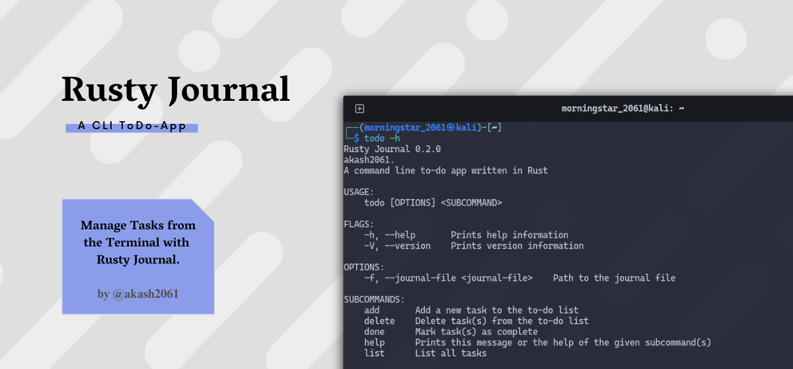
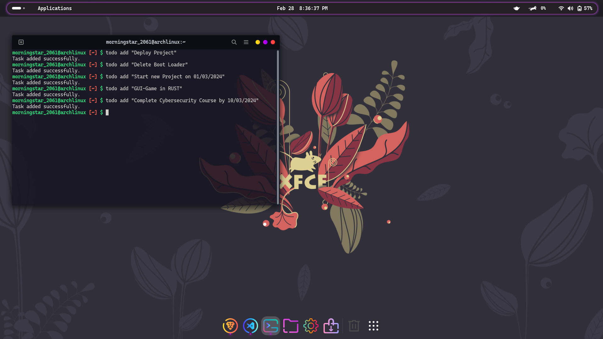
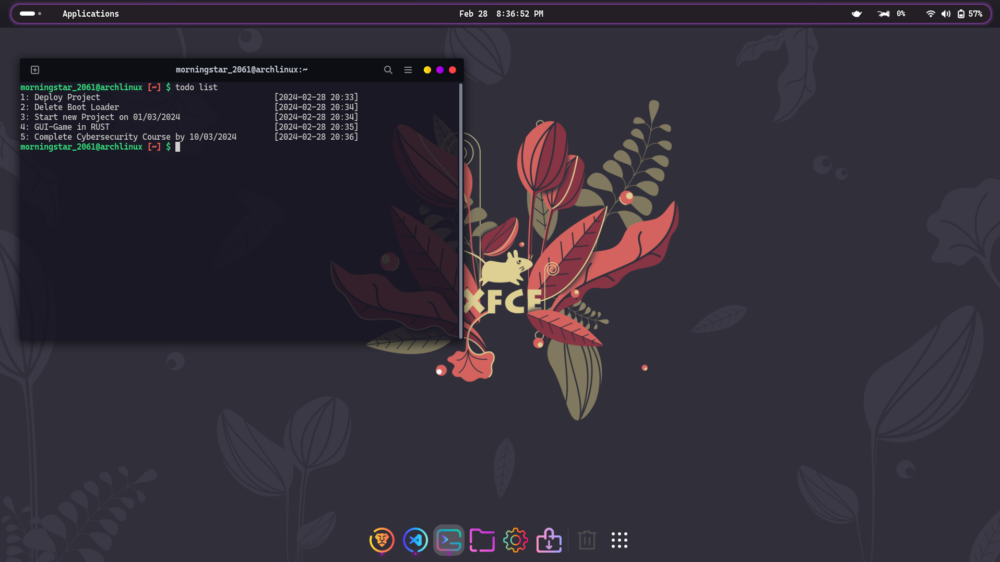
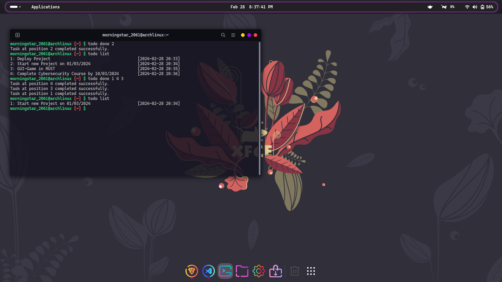
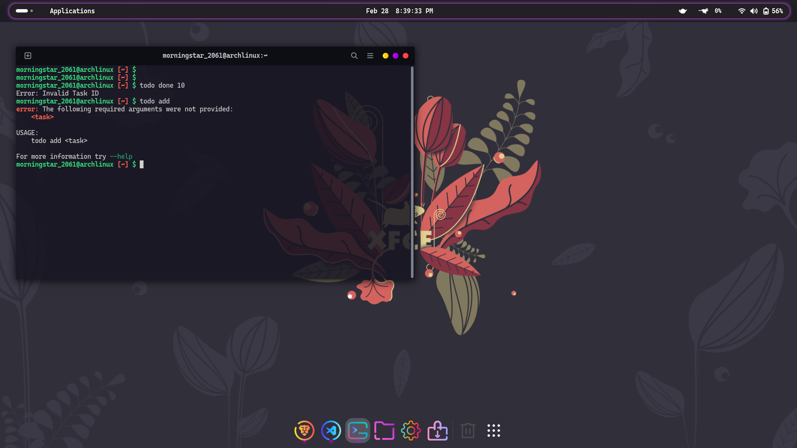
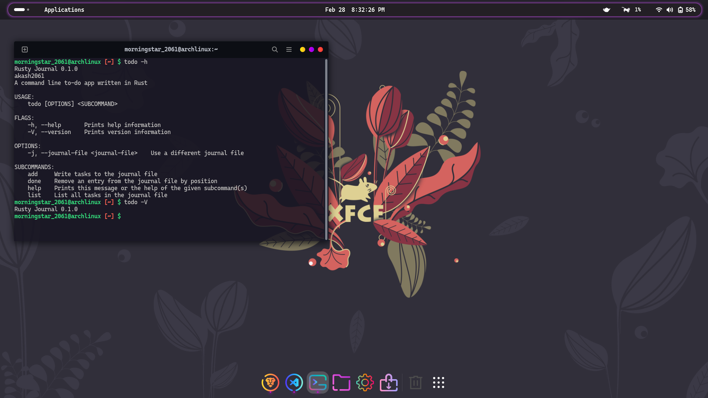

[](https://github.com/akash2061)


# Rust ToDo List 🦀

## Overviews
Welcome to the Command Line ToDo List project written in Rust! This simple and efficient ToDo list application allows you to manage your tasks directly from the command line interface.

## Features
- **Add Task:** Easily add tasks to your ToDo list.
- **List Tasks:** View all the tasks in your list along with their status.
- **Complete Task:** Remove tasks that are completed.
- **Persistence:** Your tasks are stored locally, so you can access them across sessions.

## Getting Started
### Prerequisites
Make sure you have Rust installed on your system. If not, you can download it from [rust-lang.org](https://www.rust-lang.org/).

### Installation
1. Clone this repository:
    ```bash
    git clone https://github.com/akash2061/Rusty-Journal.git
    ```
    ```bash
    cd Rusty-Journal
    ```

2. Build the project:
    ```bash
    cargo build
    ```

3. Run the application:
    ```bash
    cargo run
    ```

### Or Use Released Version

1. Go to the [Releases](https://github.com/akash2061/Rusty-Journal/releases) page or Directly [Download](https://github.com/akash2061/Rusty-Journal/releases/download/v0.2.1/todo) the latest version.
2. Download the latest release for your platform.
3. Open your terminal and navigate to the folder where the executable is downloaded.
4. Copy the executable to the `/usr/local/bin` directory using the following command:
    ```bash
    sudo cp ./todo /usr/local/bin/
    ```

    > Note: Important & Final Step:
5. Give the executable permission to run using the following command:
    ```bash
    sudo chmod +x /usr/local/bin/todo
    ```


Now you can manage your tasks from any terminal window by simply typing its name `todo`, thanks to its location in `/usr/local/bin`.

## Usage for v0.1.0 {Older Version.}
- **Adding a Task:**
    ```bash
    todo add "Buy groceries"
    ```

- **Listing Tasks:**
    ```bash
    todo list
    ```

- **Completing a Task:**
    ```bash
    todo done 1
    ```
    ```bash
    todo done 2 4 5
    ```

<hr>

## Command-Line-ToDo in Action:

### Add Task in ToDo-Journal.


### List Task.


### Complete Task.


### Error-Handling in ToDo-Journal.


### Version & Help


<hr>

## Contributing
Contributions are welcome! Feel free to submit issues or pull requests.

## License
This project is licensed under the MIT License - see the [LICENSE](LICENSE) file for details.

## Acknowledgments
- Inspired by the simplicity and elegance of Rust programming language.

Thank you for using the Rust ToDo List! Happy organizing! 🚀
